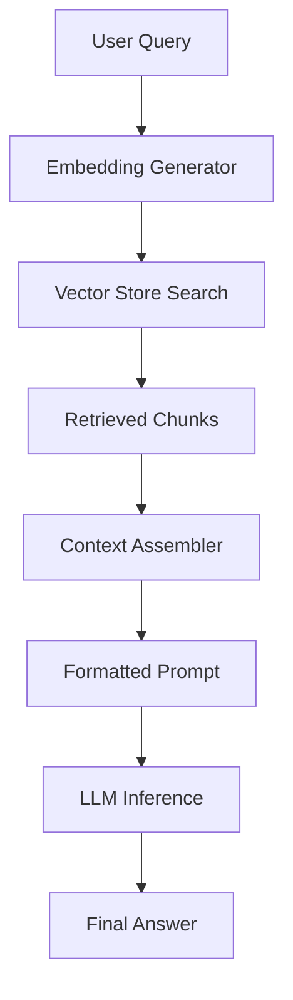

# External Memory System for Large Language Models

Mitigate context degradation in LLMs using retrieval-based external memory. This system stores long documents in a vector database (FAISS) and retrieves only the most relevant segments to construct concise prompts for the LLM.

## 🚀 Features

- **Semantic Memory**: Store and retrieve information based on meaning, not just keywords.
- **Hybrid Provider Support**: Works with local models (Ollama, HuggingFace) and cloud APIs (OpenAI, Anthropic).
- **Efficient Retrieval**: Uses FAISS for high-performance vector similarity search.
- **Local-First**: Complete privacy—run everything on your own machine without API keys using Ollama.
- **Evaluation Ready**: Includes scripts to demonstrate context degradation and measure system performance.

## 🛠️ Quick Start (Local Setup)

### 1. Install Prerequisites
Make sure you have [Ollama](https://ollama.ai/) installed and running.

```bash
# Pull the recommended local model
ollama pull llama2
```

### 2. Set Up Environment
```bash
# Create and activate virtual environment
python3 -m venv venv
source venv/bin/activate

# Install dependencies
pip install -r requirements.txt
```

### 3. Run a Quick Demo
```bash
python notebooks/demonstrate_degradation.py
```

## 💻 CLI Usage

The system includes a powerful CLI for all core operations.

```bash
# Ingest a document
python cli.py ingest data/sample.txt --source "Manual"

# Query the memory
python cli.py query "What are the main functions?" --verbose

# Start an interactive chat session
python cli.py interactive

# Check system statistics
python cli.py stats
```

## 🏗️ Architecture



## ⚙️ Configuration
Modify `config.yaml` to change models, chunk sizes, or LLM providers.

### Local Setup (Ollama)
```yaml
llm:
  provider: "ollama"
  ollama:
    model: "llama2"
```

### Cloud Setup (Gemini)
To use Google Gemini, set your API key as an environment variable:
```bash
export GOOGLE_API_KEY="your-api-key-here"
```
Or configure it directly in `config.yaml`:
```yaml
llm:
  provider: "gemini"
  gemini:
    model: "gemini-1.5-pro"
    api_key: "your-api-key-here"
```

## 🧪 Testing
Run the comprehensive suite of unit and integration tests:
```bash
pytest tests/
```

## 📄 License
MIT License
