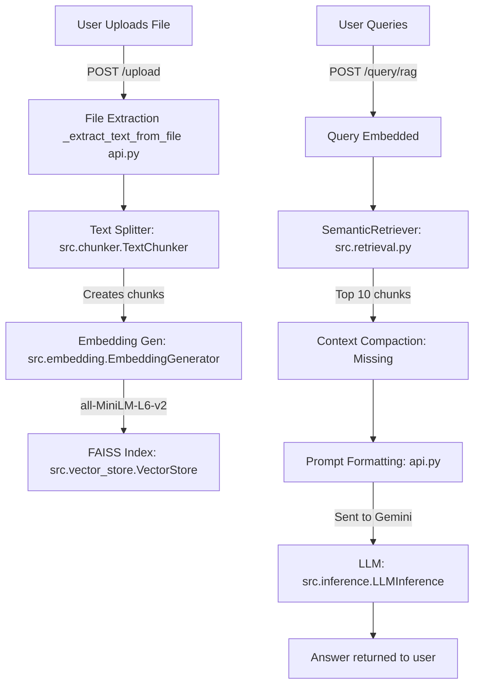

# System Audit: RAG Implementation

## A) "What’s Implemented" Summary

Here is a summary of the RAG system as currently implemented in the repository:

**Ingestion Pipeline**
- **Implemented:** Supports `.txt`, `.md`, `.pdf` (via `PyPDF2`), and `.docx` (via `python-docx`). Uses raw text extraction without structure preservation.
- **Missing:** No text chunk deduplication, hyphenation fixing, or semantic metadata extraction (like headings or page numbers).
- **Missing:** Incremental indexing is absent. The codebase currently calls `store.clear()` on every upload (`backend/api.py:164`), forcing a total re-ingestion of the document.

**Chunking Strategy**
- **Implemented:** A naive size & overlap approach using sentence boundaries (`backend/src/chunker.py`). Setting is chunk size 1024 chars, overlap 150 chars.
- **Implemented:** Metadata attached to FAISS includes `source`, `chunk_index`, and `char_offset`.
- **Missing:** Hierarchical chunking.
- **Missing:** Stable, deterministic chunk IDs across runs.

**Indexing & Storage**
- **Implemented:** Uses local transformer embeddings (`all-MiniLM-L6-v2` via `backend/src/embedding.py`) producing 384D float32 vectors. Hardware detection for CPU/CUDA/MPS exists.
- **Implemented:** Uses a FAISS `IndexFlatIP` (exact cosine match) vector store (`backend/src/vector_store.py`).
- **Missing:** Lexical index (like BM25). Dense only.
- **Missing:** Disk persistence is currently commented out in `backend/api.py:104`, causing index rebuilds on every application boot.

**Retrieval Method**
- **Implemented:** Pure Dense retrieval. Fetches the top 10 most similar chunks directly from FAISS.
- **Missing:** Hybrid retrieval capabilities.
- **Missing:** Query preprocessing (expansion, keyword extraction).

**Reranking & Relevance Filtering**
- **Implemented:** Basic relevance floor checking exists in `SemanticRetriever` logic (`backend/src/retrieval.py:60`), however `api.py` provides a threshold of 0.0, bypassing it.
- **Missing:** No cross-encoder or separate heuristic reranking step is currently present.

**Context Compaction**
- **Missing:** Raw chunks are blindly concatenated `\n\n.join()` into the LLM prompt (`backend/api.py:313`). There is no sentence extraction or token-level compaction.
- **Missing:** No metadata citations given to the LLM (e.g. `[Source X, Chunk Y]`) making grounding impossible.

**Answering Step**
- **Implemented:** Single shot generation with constraints: "Use ONLY the following retrieved context...".
- **Missing:** "Say you don't know" failsafes and rigid token budgeting per request limit. 

**Caching**
- **Implemented:** Trivial, in-memory python dictionary cache for raw text embeddings (`backend/src/embedding.py:29`).
- **Missing:** Exact prompt cache and Semantic query caching.

## B) Dataflow Diagram

## C) Token-Efficiency Analysis

**Where tokens are wasted:**
1. **Redundant chunk overlap inclusion:** Extracting consecutive chunks can cause the identical overlap windows (150 chars) to be fed repeatedly to the LLM. 
2. **"Shotgun" Context Injection:** The retriever is indiscriminately pulling 10 chunks of 1024 characters each (`backend/api.py:311`). Without filtering irrelevant sentences inside these chunks or utilizing a strict cosine similarity threshold, large sections are wasted on irrelevant prose.
3. **No semantic caching:** If user 1 asks "What is X?" and user 2 asks "Define X", the system re-runs the retrieval and the LLM generation step from zero.

**Minimum-Context Strategy:**
Instead of pumping raw chunks into the prompt, implement a **Context Compaction Step**. After retrieval, run a lexical strict-sentence match against the query or employ a tiny local NLP model to drop sentences inside those chunks that don't share keyword/semantic alignment. The LLM only receives sentences containing answering substance. 

## D) Speed Optimization Plan (Ranked)

**1. Enable Disk Persistence && Incremental Indexing (Impact: High, Complexity: S)**
- **Why:** Stops the application re-embedding large PDFs on every upload or server restart.
- **Code Locations:** Un-comment disk loading logic at `backend/api.py:104`. Alter the `/upload` endpoint to check if the file hash is already in the metadata to skip `store.clear()`.
- **Default params:** Use exact SHA-256 for document change detection.

**2. Two-Stage Retrieval via Local Reranker (Impact: High, Complexity: M)**
- **Why:** Massive accuracy improvement for small token cost. FAISS dense retrieval misses hard keyword matches, so we pull more candidates and trim the fat.
- **Code Locations:** Update `backend/src/retrieval.py`.
- **Implementation:** Return `top_k=25` from FAISS. Pass them to a CrossEncoder (`cross-encoder/ms-marco-MiniLM-L-6-v2`), score them, and take the top 5 chunks.

**3. Implement Semantic Caching (Impact: High, Complexity: M)**
- **Why:** Skip LLM generation + retrieval completely for repetitive questions, saving 100% of LLM API tokens.
- **Code Locations:** `backend/api.py` endpoint `/query/rag`.
- **Implementation:** Maintain a simple SQLite or secondary FAISS index of past queries and their text answers. On query, embed the prompt. If `cosine_sim > 0.95`, return the cached answer.

**4. Hybrid Search (FAISS + BM25) (Impact: Medium, Complexity: L)**
- **Why:** Resolves domain-specific keyword dropouts.
- **Code Locations:** New vector store class in `backend/src/vector_store.py`.
- **Implementation:** Utilize the python `rank_bm25` module alongside FAISS. Combine scores using Reciprocal Rank Fusion (RRF): `score = 1 /(60 + dense_rank) + 1 /(60 + bm25_rank)`.

**5. Add Sentence-Level Extractive Compaction (Impact: Low(Speed)/High(Token saving), Complexity: M)**
- **Why:** Minimizes input tokens right before feeding them to Gemini.
- **Code Locations:** `backend/api.py` or new `src/compaction.py`.
- **Implementation:** Split the top 5 chunks into sentences. Re-calculate the dot-product similarity of each sentence to the query. Keep only sentences > 0.3 threshold.

## E) Concrete "Next Sprint" Tasks

1. **Task 1: Prevent Index Wipes on Upload**
  - **Acceptance Criteria:** Uploading a new PDF appends chunks to FAISS without clearing the existing index. The `INDEX_PATH` is successfully persisted and loaded on app initialization.
  - **Test Plan:** Restart the API server and run a query. Ensure docs from previous sessions are queryable without re-uploading.
2. **Task 2: Reranker Integration**
  - **Acceptance Criteria:** Expand FAISS initial fetch from 10 to 30 chunks. Add a local HuggingFace `CrossEncoder` model to score and reorder those 30 chunks, taking the top 5 to the LLM prompt.
  - **Test Plan:** Measure relevance retrieval for needle-in-a-haystack type questions against current baseline.
3. **Task 3: Semantic Caching Layer**
  - **Acceptance Criteria:** Add an in-memory dictionary or small FAISS instance that holds query embeddings. Returns a cached answer in <100ms if the similarity to a prior query is >0.92.
  - **Test Plan:** Ask the identical query twice. Verify the second request completes in <100ms and invokes zero LLM API calls.
4. **Task 4: Implement Basic Context Preprocessing (Citations)**
  - **Acceptance Criteria:** Adjust chunk formatting logic in `api.py` to prepend chunks with metadata like: "[Source: doc_name.pdf, Offset: X]". Add a strict instruction to the gemini prompt to cite source offsets.
  - **Test Plan:** Verify LLM responses output raw offsets instead of hallucinations.
5. **Task 5: Refactor BM25 Hybrid Retrieval**
  - **Acceptance Criteria:** Add lexical sparse indices to the `VectorStore` class alongside FAISS. Implement Reciprocal Rank Fusion helper function in `SemanticRetriever`.
  - **Test Plan:** Query for precise un-embeddable terms (like random UUIDs or specific ID numbers) existing in the text and verify hybrid model pulls the exact match.
