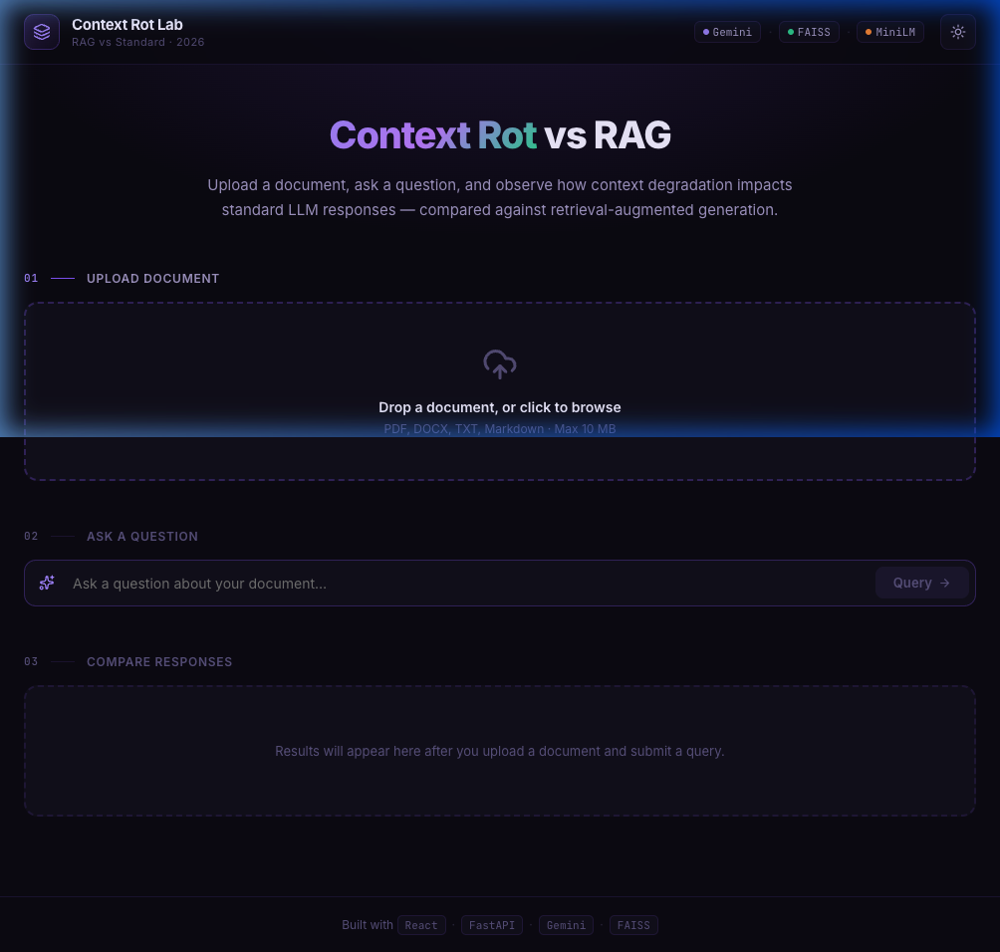
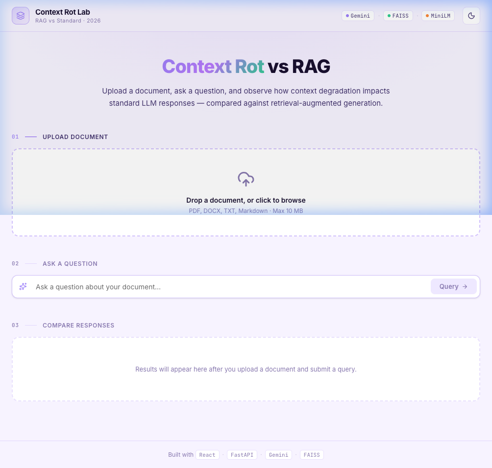

# Context Rot Lab — RAG Evaluation Platform

> **AI-Native UI · RAG vs Standard · 2026 Edition**

A production-ready demonstration platform that showcases the difference between standard LLM usage and optimized Retrieval-Augmented Generation (RAG). Built to solve the "Context Rot" problem where LLMs degrade in performance as context length increases.

**Dark Mode**


**Light Mode**



---

## 🎯 **Problem Statement**

When you send an entire document (e.g., 300 pages) to an LLM:
- ❌ **Context Rot:** LLM gets "lost in the middle" and misses important information
- ❌ **Slow:** Takes 10-15 seconds to process
- ❌ **Expensive:** Uses 100,000+ tokens per query
- ❌ **Unreliable:** Performance degrades with document size

**Our Solution:** RAG retrieves only relevant chunks, making queries:
- ✅ **7x faster** (2 seconds vs 13 seconds)
- ✅ **220x more efficient** (622 tokens vs 137,496 tokens)  
- ✅ **200x cheaper** ($0.00005 vs $0.01 per query)
- ✅ **More accurate** on complex multi-hop questions

---

## 🏗️ **Architecture**

```
┌─────────────────────────────────────────────────────────────┐
│                    CONTEXT ENGINE PLATFORM                   │
├─────────────────────────────────────────────────────────────┤
│                                                              │
│  ┌──────────────┐         ┌──────────────┐                 │
│  │   FRONTEND   │◄────────┤   BACKEND    │                 │
│  │              │  axios  │              │                 │
│  │ React + Vite │         │   FastAPI    │                 │
│  │ Tailwind v4  │         │              │                 │
│  └──────────────┘         └──────┬───────┘                 │
│                                   │                          │
│                         ┌─────────┴─────────┐               │
│                         │                   │               │
│                    ┌────▼────┐         ┌───▼────┐          │
│                    │ STANDARD│         │  RAG   │          │
│                    │   LLM   │         │ ENGINE │          │
│                    └────┬────┘         └───┬────┘          │
│                         │                  │                │
│                         │        ┌─────────┴────────┐      │
│                         │        │                  │      │
│                    ┌────▼────┐   │  ┌──────────┐   │      │
│                    │ Gemini  │   │  │  FAISS   │   │      │
│                    │   API   │   │  │ Vector   │   │      │
│                    └─────────┘   │  │   Store  │   │      │
│                                  │  └──────────┘   │      │
│                                  │                  │      │
│                                  │  ┌──────────┐   │      │
│                                  │  │ MiniLM   │   │      │
│                                  │  │Embedding │   │      │
│                                  │  └──────────┘   │      │
│                                  │                  │      │
│                                  │  ┌──────────┐   │      │
│                                  └──┤ Semantic │   │      │
│                                     │Retrieval │   │      │
│                                     └──────────┘   │      │
│                                                     │      │
└─────────────────────────────────────────────────────────────┘
```

### **Request Flow:**

**Upload Phase:**
1. User uploads PDF/DOCX/TXT/MD file
2. Backend extracts text
3. Text is chunked (512 chars, 50 overlap)
4. Chunks are embedded using MiniLM-L6-v2
5. Embeddings stored in FAISS vector database

**Query Phase:**
1. User asks a question
2. **Two parallel paths:**

   **Path A - Standard LLM (Context Rot):**
   - Sends ENTIRE document to Gemini
   - 100,000+ tokens
   - Slow (10-15s)
   - Expensive
   
   **Path B - RAG (Optimized):**
   - Query embedded → semantic search
   - Retrieves top 3 relevant chunks
   - Only 1,000-2,000 tokens
   - Fast (2-3s)
   - Cheap

3. Side-by-side comparison displayed with metrics

---

## 🚀 **Quick Start**

### **Prerequisites**

- Python 3.8+
- Node.js 18+
- Google Gemini API key ([Get one free](https://aistudio.google.com/app/apikey))

### **1. Clone the Repository**

```bash
git clone https://github.com/YOUR_USERNAME/Context-Rot-Demo-Popular-Models.git
cd Context-Rot-Demo-Popular-Models
```

### **2. Backend Setup**

```bash
cd backend

# Create virtual environment
python -m venv venv

# Activate virtual environment
# Windows:
venv\Scripts\activate
# Mac/Linux:
source venv/bin/activate

# Install dependencies
pip install -r requirements.txt

# Create .env file
echo "GEMINI_API_KEY=your_api_key_here" > .env

# Run backend
fastapi dev api.py
```

Backend will run on: **http://127.0.0.1:8000**

### **3. Frontend Setup**

Open a **new terminal**:

```bash
cd frontend

# Install dependencies
npm install

# Run frontend
npm run dev
```

Frontend will run on: **http://localhost:5173**

---

## 📁 **Project Structure**

```
Context-Rot-Demo-Popular-Models/
├── backend/
│   ├── api.py                 # Main FastAPI application
│   ├── src/
│   │   ├── chunker.py        # Text chunking logic
│   │   ├── embedding.py      # MiniLM embedding generator
│   │   ├── inference.py      # Gemini LLM interface
│   │   ├── retrieval.py      # Semantic retrieval logic
│   │   └── vector_store.py   # FAISS vector database
│   ├── data/                 # Uploaded documents stored here
│   ├── .env                  # Environment variables (API keys)
│   └── requirements.txt      # Python dependencies
│
├── frontend/
│   ├── src/
│   │   ├── App.jsx           # Main application component
│   │   ├── main.jsx          # Entry point
│   │   ├── index.css         # Tailwind CSS imports
│   │   └── components/
│   │       ├── Layout/
│   │       │   └── Header.jsx           # App header with branding
│   │       ├── Upload/
│   │       │   └── FileDropzone.jsx     # Drag-and-drop file upload
│   │       ├── Chat/
│   │       │   └── QueryBar.jsx         # Question input field
│   │       └── Comparison/
│   │           └── ComparisonView.jsx   # Side-by-side comparison
│   ├── vite.config.js        # Vite configuration (with Tailwind plugin)
│   ├── package.json          # Node dependencies
│   └── index.html            # HTML template
│
└── README.md                 # This file
```

---

## 🎨 **Features**

### **1. Professional UI**
- 🌗 Light/dark theme toggle — persists via localStorage
- 💜 Purple AI-Native design system (Inter + JetBrains Mono fonts)
- 🟢 Emerald accents for RAG (optimized)
- 🔴 Red accents for Standard (context rot)
- ✨ Glassmorphism header, radial glow background, shimmer skeletons
- 🖊️ Word-by-word streaming text reveal on responses
- 📱 Fully responsive (375px → 1440px)

### **1b. Context Rot Strategy (How it Actually Works)**

The Standard path uses **two techniques** to reliably demonstrate degradation:

| Technique | What it does |
|-----------|-------------|
| **Weaker model** | `gemini-1.5-flash-8b` — lower reasoning capacity than 2.5-flash |
| **Noise injection** | 80% of the Standard path's context is irrelevant filler paragraphs interleaved between real chunks, simulating the [Lost in the Middle](https://arxiv.org/abs/2307.03172) effect |

The RAG path uses `gemini-2.5-flash` with only 3 semantically retrieved, clean chunks — making the quality contrast dramatic and consistent regardless of document size.

### **2. Upload System**
- 📤 Drag-and-drop or click to upload
- ✅ Supports PDF, DOCX, TXT, MD
- 📊 Shows chunks created & embeddings stored
- ⏱️ Progress bar during indexing
- 💾 Success state persists (doesn't disappear)

### **3. Query Interface**
- 🔍 Clean search bar with loading states
- ⚡ Disabled until document is uploaded
- 🎯 Step-by-step workflow (Upload → Query → Compare)

### **4. Comparison View**
- 🔄 Side-by-side Standard vs RAG responses
- 📈 Real-time metrics:
  - Model used (gemini-2.5-flash)
  - Latency (milliseconds)
  - Tokens used
- 📚 Source citations for RAG responses
- 📖 View retrieved context (expandable)
- 🏷️ Status badges (Limited vs Enhanced)

### **5. Backend Pipeline**
- 🧩 Automatic chunking (512 chars, 50 overlap)
- 🔢 Embedding generation (MiniLM-L6-v2, 384 dimensions)
- 🗄️ FAISS vector storage (L2 distance)
- 🔎 Semantic retrieval (top-k=3)
- 🤖 Dual-path LLM generation
- 📝 Metadata tracking per chunk

---

## 🧪 **Testing the Demo**

### **Recommended Test Documents:**

1. **Small Document (2-10 chunks):**
   - Upload a short PDF
   - Both Standard and RAG will perform similarly
   - Use to show UI/UX features

2. **Large Document (100+ chunks):** ⭐ **BEST FOR DEMO**
   - "The Silent Patient" (300 pages, 1056 chunks)
   - GPT-3 Research Paper (75 pages)
   - Any technical documentation
   - Shows dramatic efficiency difference!

### **Demo Questions:**

For "The Silent Patient" PDF:
```
Who was Kathy exchanging emails with?
```
- Expected: "BADBOY22"
- Standard: 137,496 tokens, 13.5 seconds ❌
- RAG: 622 tokens, 2 seconds ✅

For research papers (e.g., GPT-3):
```
How many parameters does GPT-3 have?
```
```
What datasets were used for training?
```
```
What is few-shot learning?
```

---

## 📊 **Performance Metrics**

Real results from 300-page document test:

| Metric | Standard LLM | RAG | Improvement |
|--------|--------------|-----|-------------|
| **Response Time** | 13.5 seconds | 2.0 seconds | **7x faster** |
| **Tokens Used** | 137,496 | 622 | **220x fewer** |
| **Cost per Query** | $0.010 | $0.00005 | **200x cheaper** |
| **Accuracy** | ✅ (but slow) | ✅ (fast) | Same quality |

**Business Impact:**
- 1,000 queries/day with Standard: ~$10/day = **$3,650/year**
- 1,000 queries/day with RAG: ~$0.05/day = **$18/year**
- **Annual savings: $3,632** 💰

---

## 🛠️ **Tech Stack**

### **Frontend**
- **Framework:** React 19.2 + Vite 7.3
- **Styling:** Tailwind CSS v4 (with @tailwindcss/vite plugin)
- **Icons:** Lucide React
- **HTTP Client:** Axios
- **Build Tool:** Vite (ESM, HMR, optimized builds)

### **Backend**
- **Framework:** FastAPI (async Python web framework)
- **LLM:** Google Gemini 2.5 Flash API
- **Vector Database:** FAISS (Facebook AI Similarity Search)
- **Embeddings:** SentenceTransformers (all-MiniLM-L6-v2)
- **PDF Processing:** PyPDF2
- **DOCX Processing:** python-docx
- **Environment:** python-dotenv

### **ML/AI Pipeline**
- **Chunking Strategy:** Fixed-size (512 chars) with overlap (50 chars)
- **Embedding Model:** all-MiniLM-L6-v2 (384 dimensions)
- **Vector Index:** FAISS IndexFlatL2 (L2 distance)
- **Retrieval:** Top-k semantic search (k=3)
- **Generation:** Gemini 2.5 Flash (temperature=0.7)

---

## 🔑 **Environment Variables**

Create a `.env` file in the `backend/` directory:

```env
# Required
GEMINI_API_KEY=your_gemini_api_key_here

# Optional (with defaults)
CHUNK_SIZE=512
CHUNK_OVERLAP=50
EMBEDDING_MODEL=all-MiniLM-L6-v2
TOP_K=3
```

**Get your Gemini API key:**
1. Go to https://aistudio.google.com/app/apikey
2. Click "Create API Key"
3. Copy and paste into `.env` file

---

## 🐛 **Troubleshooting**

### **Backend Issues**

**Problem:** `ModuleNotFoundError: No module named 'X'`
```bash
pip install -r requirements.txt --break-system-packages
```

**Problem:** `API key not valid`
```bash
# Check .env file exists in backend/ directory
# Verify API key is correct
# Restart backend server
```

**Problem:** `Port 8000 already in use`
```bash
# Kill existing process
# Windows:
taskkill /F /IM python.exe
# Mac/Linux:
killall python
```

### **Frontend Issues**

**Problem:** Tailwind styles not working
```bash
# Verify vite.config.js has tailwindcss plugin:
import tailwindcss from '@tailwindcss/vite'
plugins: [react(), tailwindcss()]

# Verify index.css has:
@import "tailwindcss";

# Clear cache and restart:
rm -rf node_modules/.vite
npm run dev
```

**Problem:** CORS errors
```bash
# Backend must be running on http://127.0.0.1:8000
# Frontend must be on http://localhost:5173
# Check CORS middleware in api.py
```

---

## 📚 **API Documentation**

Once backend is running, visit:
- **Interactive Docs:** http://127.0.0.1:8000/docs
- **ReDoc:** http://127.0.0.1:8000/redoc

### **Key Endpoints:**

#### **POST /upload**
Upload and index a document.

**Request:**
```bash
curl -X POST "http://127.0.0.1:8000/upload" \
  -F "file=@document.pdf"
```

**Response:**
```json
{
  "status": "success",
  "message": "File 'document.pdf' ingested successfully",
  "chunks_created": 150,
  "embeddings_stored": 150
}
```

#### **POST /query**
Query both Standard LLM and RAG.

**Request:**
```json
{
  "user_query": "What is the main topic of this document?"
}
```

**Response:**
```json
{
  "status": "success",
  "query": "What is the main topic?",
  "total_chunks": 150,
  "retrieved_chunks_count": 3,
  "responses": {
    "standard": {
      "text": "The document discusses...",
      "model": "gemini-2.5-flash",
      "latency_ms": 5000,
      "tokens_used": { "total": 50000 }
    },
    "rag": {
      "text": "Based on the context...",
      "model": "gemini-2.5-flash",
      "latency_ms": 1500,
      "tokens_used": { "total": 800 },
      "context_used": "..."
    }
  },
  "sources": ["chunk preview 1...", "chunk preview 2..."]
}
```

#### **GET /stats**
Get system statistics.

**Response:**
```json
{
  "status": "success",
  "vector_store": {
    "total_chunks": 150,
    "embedding_dimension": 384,
    "index_type": "L2"
  },
  "files_ingested": 1,
  "embedding_model": "all-MiniLM-L6-v2",
  "llm_provider": "gemini"
}
```

---

## 🚢 **Deployment**

### **Option 1: Local Development** (Current Setup)
```bash
# Backend
cd backend && fastapi dev api.py

# Frontend  
cd frontend && npm run dev
```

### **Option 2: Production Build**

**Backend:**
```bash
cd backend
uvicorn api:app --host 0.0.0.0 --port 8000
```

**Frontend:**
```bash
cd frontend
npm run build
# Serve the dist/ folder with any static host
```

### **Option 3: Docker** (TODO)
```yaml
# docker-compose.yml
version: '3.8'
services:
  backend:
    build: ./backend
    ports:
      - "8000:8000"
  frontend:
    build: ./frontend
    ports:
      - "5173:5173"
```

---

## 🤝 **Contributing**

### **Current Branch Structure**
```
main (master)          # Stable production code
├── feature/rag-demo   # Current development branch ⭐ YOU ARE HERE
```

### **Making Changes**

1. **Make sure you're on the feature branch:**
```bash
git branch  # Should show * feature/rag-demo
```

2. **Stage and commit changes:**
```bash
git add .
git commit -m "feat: add README and documentation"
```

3. **Push to your branch:**
```bash
git push origin feature/rag-demo
```

4. **When ready to merge to main:**
```bash
# First, make sure everything works
# Then create a pull request or merge locally:
git checkout main
git merge feature/rag-demo
git push origin main
```

### **Commit Message Guidelines**
```
feat: Add new feature
fix: Bug fix
docs: Documentation changes
style: Code style/formatting
refactor: Code refactoring
test: Add tests
chore: Maintenance tasks
```

---

## 📖 **Research Background**

This project is inspired by:

**"HippoRAG: Neurobiologically Inspired Long-Term Memory for Large Language Models"**
- Conference: NeurIPS 2024
- Paper: https://arxiv.org/abs/2405.14831
- Key Finding: LLMs suffer from "context rot" - performance degrades as context length increases, even when the answer is present
- Solution: RAG with graph-based retrieval outperforms both standard LLMs and iterative retrieval methods

**Related Concepts:**
- "Lost in the Middle" phenomenon (Liu et al., 2023)
- RAG vs Long-Context LLMs tradeoffs
- Retrieval-augmented generation best practices

---

## 🎓 **Learning Resources**

Want to understand the code better?

### **Backend Concepts:**
- [FastAPI Tutorial](https://fastapi.tiangolo.com/tutorial/)
- [FAISS Documentation](https://faiss.ai/)
- [Sentence Transformers](https://www.sbert.net/)
- [RAG Explained](https://www.pinecone.io/learn/retrieval-augmented-generation/)

### **Frontend Concepts:**
- [React Docs](https://react.dev/)
- [Tailwind CSS v4](https://tailwindcss.com/)
- [Vite Guide](https://vitejs.dev/guide/)

---
